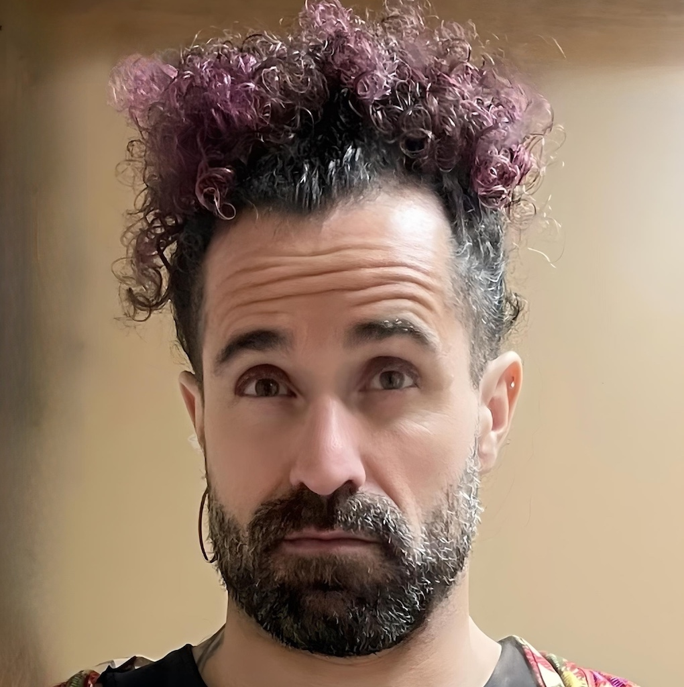

# Cuducos

## 📌 Informações

- **Pronomes:** ela/dela - she/her, elu/delu - they/them, não uso pronomes - no pronouns
- **LinkedIn:** https://www.linkedin.com/in/caarlos0/
- **GitHub:** https://github.com/caarlos0

## 🧠 Bio

Cuducos trabalha no time de engenharia do Bluesky, desenvolvendo tecnologias abertas e descentralizadas para a conversa pública. Com doutorado em sociologia, aproxima tecnologia, cultura e política com um olhar de tecnologia como ativismo. Participou da fundação da Operação Serenata de Amor e criou projetos como Minha Receita e Arrobas Pralamentar. Também atuou em organizações como Shopify, World Bank, Open Knowledge Brasil e Jusbrasil.

## 🎤 Atividades

- [Tecnologias abertas para políticas públicas](../atividades/tecnologias-abertas-para-politicas-publicas.md)
